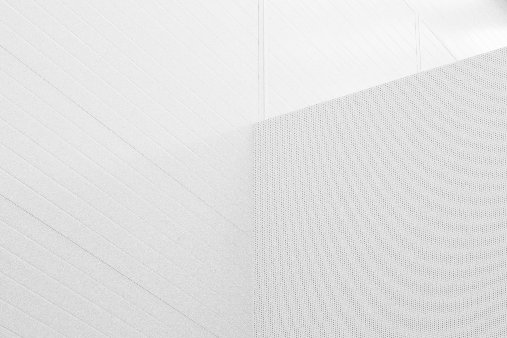

---
# Feel free to add content and custom Front Matter to this file.
# To modify the layout, see https://jekyllrb.com/docs/themes/#overriding-theme-defaults

layout: default
---

<!--- -->

	<h1 style="font-size:2.5em; color:#444; margin-bottom:0.5em;">Making Your Dreams Come True</h1>
	
Welcome Home Vacationing helps you plan the perfect getaway. Let us turn your travel dreams into reality!

	

	<h2 style="color:#444;">Contact Information</h2>
	
Email: <a href="mailto:dani@welcomhomevacationing.com">dani@welcomhomevacationing.com</a> 
	Phone: <a href="tel:+12489249438">(248) 924-9438</a>

    

        
    

	

